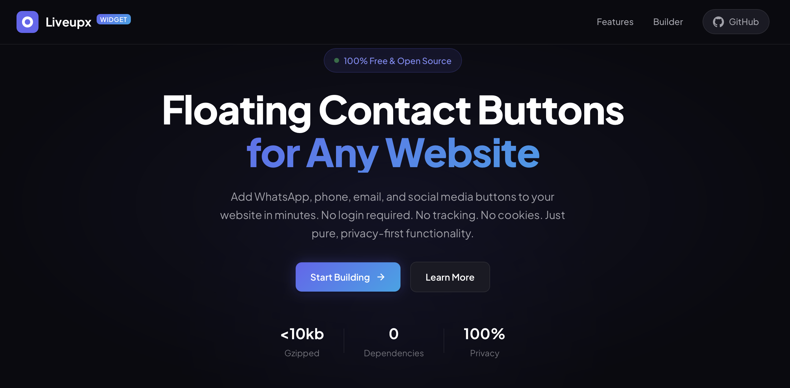
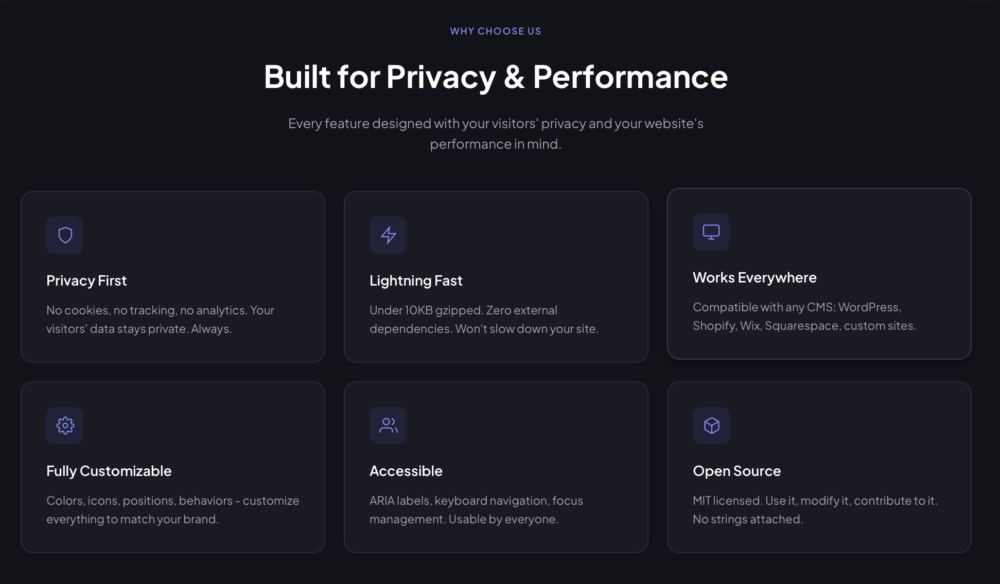
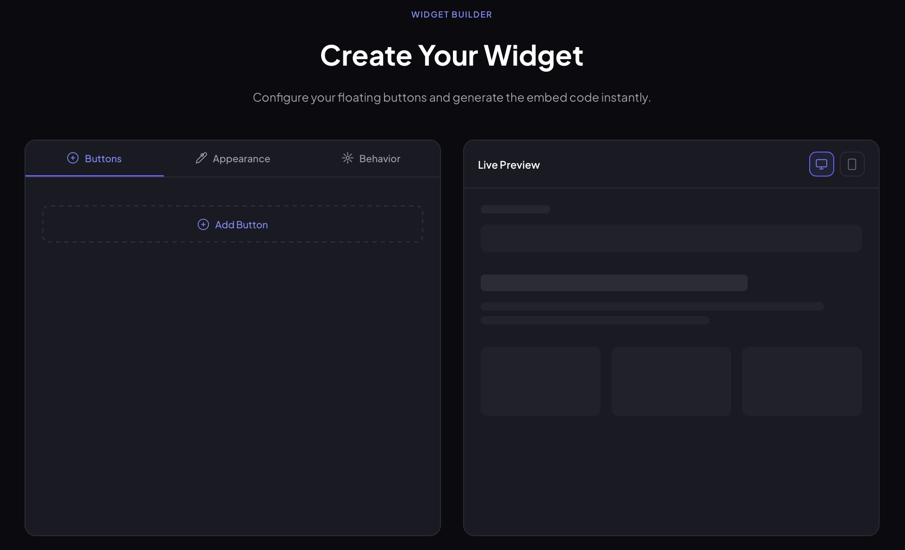
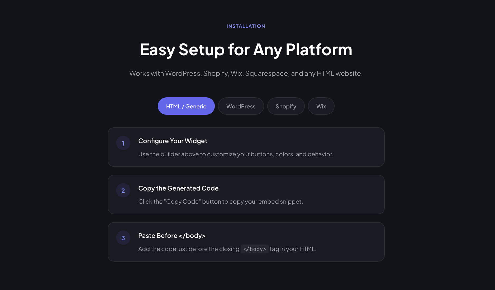
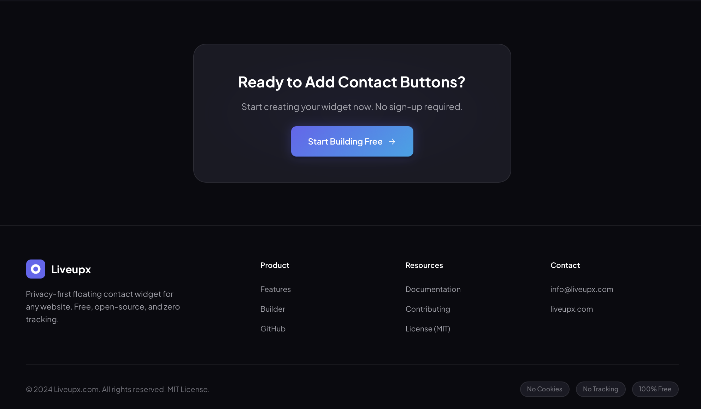

# 🚀 Floating Calls & Social Buttons Widget 
by Liveupx.com

[](https://opensource.org/licenses/MIT)
[](https://github.com/liveupx/Floating-Calls-Social-Buttons-Widget/stargazers)
[](CONTRIBUTING.md)
[](package.json)
[](dist/widget.min.js)

A **free, open-source, privacy-first** floating contact button widget for any website. Add WhatsApp, phone, email, social media, and custom contact buttons to your site in minutes—no coding required!

🔗 **[Live Demo & Builder](https://liveupx.github.io/Floating-Calls-Social-Buttons-Widget/)** | 📚 **[Documentation](#documentation)** | 💬 **[Support](#support)**

![Floating Widget Preview]







---

## ✨ Features

### 🎯 Core Features
- **100% Client-Side** – No backend, no database, no server required
- **Privacy-First** – Zero cookies, zero tracking, zero analytics
- **Lightweight** – Under 10KB gzipped, zero dependencies
- **Universal Compatibility** – Works on any website, CMS, or tech stack
- **Accessible** – Full ARIA support, keyboard navigation, screen reader friendly

### 🎨 Customization
- **16+ Button Types** – Phone, WhatsApp, Email, SMS, Telegram, Messenger, Viber, Instagram, Facebook, Twitter/X, LinkedIn, YouTube, TikTok, Discord, Skype, WeChat, LINE, and custom links
- **Visual Builder** – Configure everything without touching code
- **Position Control** – Place in any corner with custom offsets
- **Appearance Options** – Colors, sizes, icons, labels, animations
- **Behavior Settings** – Click/hover triggers, scroll triggers, delays

### 🛡️ Technical Excellence
- **Shadow DOM Isolation** – No CSS conflicts with your site
- **Mobile Responsive** – Optimized for all screen sizes
- **No External Dependencies** – Pure vanilla JavaScript
- **SEO Friendly** – No impact on page speed or rankings
- **Open Source** – MIT licensed, free forever

---

## 🚀 Quick Start

### Option 1: Use the Visual Builder (Recommended)

1. Visit our **[Online Builder](https://liveupx.github.io/Floating-Calls-Social-Buttons-Widget/)**
2. Add your contact buttons
3. Customize appearance and behavior
4. Copy the generated code
5. Paste into your website before `</body>`

### Option 2: CDN Installation

Add this code before your closing `</body>` tag:

```html
<!-- Floating Widget by LiveUpx.com -->
<script>
  window.floatingWidgetConfig = {
    buttons: [
      { type: 'whatsapp', value: '1234567890', label: 'WhatsApp Us' },
      { type: 'phone', value: '+1234567890', label: 'Call Us' },
      { type: 'email', value: 'hello@example.com', label: 'Email Us' }
    ],
    position: { vertical: 'bottom', horizontal: 'right' },
    mainButton: { icon: 'chat', color: '#6366f1' }
  };
</script>
<script src="https://cdn.jsdelivr.net/gh/liveupx/Floating-Calls-Social-Buttons-Widget@latest/dist/widget.min.js" defer></script>
```

### Option 3: Self-Hosted

1. Download `dist/widget.min.js`
2. Upload to your server
3. Reference it in your HTML:

```html
<script>
  window.floatingWidgetConfig = { /* your config */ };
</script>
<script src="/path/to/widget.min.js" defer></script>
```

---

## 📖 Documentation

### Configuration Options

```javascript
window.floatingWidgetConfig = {
  // Contact buttons array
  buttons: [
    {
      type: 'whatsapp',      // Button type (see supported types below)
      value: '1234567890',   // Contact value (phone, username, URL, etc.)
      label: 'Chat with us', // Display label
      color: '#25D366',      // Button color (optional)
      newTab: true           // Open in new tab (optional, default: true)
    }
  ],

  // Main toggle button
  mainButton: {
    icon: 'chat',     // Icon: 'plus', 'chat', 'phone', 'menu', 'heart'
    color: '#6366f1', // Background color
    size: 56          // Size in pixels (40-72)
  },

  // Widget position
  position: {
    vertical: 'bottom',   // 'top' or 'bottom'
    horizontal: 'right',  // 'left' or 'right'
    offsetX: 24,          // Horizontal offset in pixels
    offsetY: 24           // Vertical offset in pixels
  },

  // Appearance settings
  appearance: {
    buttonSize: 48,           // Contact button size (32-64)
    spacing: 12,              // Space between buttons (4-24)
    expandDirection: 'up',    // 'up', 'down', 'left', 'right'
    showLabels: true,         // Show button labels on hover
    pulseAnimation: true,     // Pulsing animation on main button
    shadow: true              // Button shadows
  },

  // Behavior settings
  behavior: {
    trigger: 'click',         // 'click' or 'hover'
    showDelay: 0,             // Delay before showing widget (seconds)
    scrollTrigger: false,     // Show only after scrolling
    scrollOffset: 100,        // Scroll distance to trigger (pixels)
    closeOnOutsideClick: true // Close when clicking outside
  }
};
```

### Supported Button Types

| Type | Description | Value Format |
|------|-------------|--------------|
| `phone` | Phone call | `+1234567890` |
| `whatsapp` | WhatsApp chat | `1234567890` (without +) |
| `email` | Email | `you@example.com` |
| `sms` | SMS message | `+1234567890` |
| `telegram` | Telegram | `username` |
| `messenger` | Facebook Messenger | `page-id` |
| `viber` | Viber | `+1234567890` |
| `instagram` | Instagram | `username` |
| `facebook` | Facebook | `page-name` |
| `twitter` | Twitter/X | `username` |
| `linkedin` | LinkedIn | `username` or `company/name` |
| `youtube` | YouTube | `@channel` or `channel-id` |
| `tiktok` | TikTok | `@username` |
| `discord` | Discord | `invite-code` |
| `skype` | Skype | `username?call` |
| `wechat` | WeChat | WeChat ID (display only) |
| `line` | LINE | `line-id` |
| `link` | Custom URL | Full URL |

### JavaScript API

```javascript
// Get widget instance
const widget = window.FloatingWidget;

// Update configuration
widget.updateConfig({
  mainButton: { color: '#ff0000' }
});

// Add a new button
widget.addButton({
  type: 'whatsapp',
  value: '1234567890',
  label: 'WhatsApp'
});

// Remove a button by index
widget.removeButton(0);

// Show/hide widget
widget.show();
widget.hide();

// Expand/collapse buttons
widget.expand();
widget.collapse();

// Destroy widget
widget.destroy();
```

---

## 🔌 Platform Installation Guides

### WordPress

1. Go to **Appearance → Theme Editor** (or use a plugin like "Insert Headers and Footers")
2. Find `footer.php` or add to footer scripts
3. Paste the widget code before `</body>`
4. Save changes

Or use a plugin:
- **Insert Headers and Footers** by WPBeginner
- **Header Footer Code Manager**
- **WPCode**

### Shopify

1. Go to **Online Store → Themes → Actions → Edit code**
2. Find `theme.liquid`
3. Paste the widget code before `</body>`
4. Save

### Wix

1. Go to **Settings → Custom Code**
2. Click **Add Custom Code**
3. Paste the widget code
4. Set placement to **Body - end**
5. Apply to **All pages**

### Squarespace

1. Go to **Settings → Advanced → Code Injection**
2. Paste in the **Footer** section
3. Save

### Webflow

1. Go to **Project Settings → Custom Code**
2. Paste in **Footer Code** section
3. Publish your site

### HTML/Static Sites

Simply paste the code before `</body>` in your HTML files.

---

## 🔒 Privacy Philosophy

We believe in **privacy by design**:

- **No Cookies** – We don't set any cookies, ever
- **No Tracking** – No analytics, no user tracking, no data collection
- **No External Requests** – All code runs locally, no data leaves your site
- **No Backend** – No servers to hack, no databases to breach
- **No Dependencies** – No third-party libraries that could inject tracking
- **Open Source** – Full transparency, audit the code yourself

Your visitors' privacy is respected. Period.

---

## 🛠️ Development

### Project Structure

```
floating-widget/
├── index.html         # Builder page
├── css/
│   └── builder.css    # Builder styles
├── js/
│   └── builder.js     # Builder logic
├── src/
│   └── widget.js      # Widget source code
├── dist/
│   ├── widget.min.js      # Minified production widget
│   └── widget.min.js.map  # Source map
├── examples/              # Usage examples
├── README.md
├── CONTRIBUTING.md
└── LICENSE
```

### Building from Source

```bash
# Clone the repository
git clone https://github.com/liveupx/Floating-Calls-Social-Buttons-Widget.git
cd Floating-Calls-Social-Buttons-Widget

# Install dependencies
npm install

# Build minified version
npm run build

# Start development server
npm run dev
```

### NPM Scripts

```bash
npm run build    # Build minified widget
npm run dev      # Start dev server
npm run lint     # Run linter
npm run test     # Run tests
```

---

## 🌟 Examples

### Minimal Setup

```html
<script>
  window.floatingWidgetConfig = {
    buttons: [
      { type: 'whatsapp', value: '1234567890' }
    ]
  };
</script>
<script src="https://cdn.jsdelivr.net/gh/liveupx/Floating-Calls-Social-Buttons-Widget@latest/dist/widget.min.js" defer></script>
```

### Full-Featured Setup

```html
<script>
  window.floatingWidgetConfig = {
    buttons: [
      { type: 'whatsapp', value: '1234567890', label: 'WhatsApp', color: '#25D366' },
      { type: 'phone', value: '+1234567890', label: 'Call Us', color: '#22c55e' },
      { type: 'email', value: 'hello@example.com', label: 'Email', color: '#ea4335' },
      { type: 'telegram', value: 'username', label: 'Telegram', color: '#0088cc' },
      { type: 'instagram', value: 'username', label: 'Instagram', color: '#E4405F' }
    ],
    mainButton: {
      icon: 'chat',
      color: '#6366f1',
      size: 60
    },
    position: {
      vertical: 'bottom',
      horizontal: 'right',
      offsetX: 20,
      offsetY: 20
    },
    appearance: {
      buttonSize: 48,
      spacing: 12,
      expandDirection: 'up',
      showLabels: true,
      pulseAnimation: true
    },
    behavior: {
      trigger: 'click',
      showDelay: 2,
      scrollTrigger: true,
      scrollOffset: 200
    }
  };
</script>
<script src="https://cdn.jsdelivr.net/gh/liveupx/Floating-Calls-Social-Buttons-Widget@latest/dist/widget.min.js" defer></script>
```

### Left-Side Position

```html
<script>
  window.floatingWidgetConfig = {
    buttons: [
      { type: 'phone', value: '+1234567890' },
      { type: 'email', value: 'hello@example.com' }
    ],
    position: {
      vertical: 'bottom',
      horizontal: 'left',
      offsetX: 20,
      offsetY: 20
    },
    appearance: {
      expandDirection: 'up'
    }
  };
</script>
```

---

## 🤝 Contributing

We love contributions! Please read our [Contributing Guide](CONTRIBUTING.md) to get started.

### Ways to Contribute

- 🐛 Report bugs
- 💡 Suggest features
- 📝 Improve documentation
- 🔧 Submit pull requests
- ⭐ Star the repo
- 📢 Spread the word

---

## 💖 Sponsors

Support this project by becoming a sponsor. Your logo will show up here with a link to your website.

**[Become a Sponsor](https://github.com/sponsors/liveupx)**

---

## 📄 License

This project is licensed under the **MIT License** – see the [LICENSE](LICENSE) file for details.

You are free to:
- ✅ Use commercially
- ✅ Modify
- ✅ Distribute
- ✅ Use privately

---

## 🙏 Credits

Developed with ❤️ by **[LiveUpx.com](https://liveupx.com)**

### Technologies Used
- Vanilla JavaScript (ES6+)
- Shadow DOM
- CSS3 Animations
- SVG Icons

---

## 📞 Support

- 📧 **Email**: [info@liveupx.com](mailto:info@liveupx.com)
- 🐛 **Issues**: [GitHub Issues](https://github.com/liveupx/Floating-Calls-Social-Buttons-Widget/issues)
- 💬 **Discussions**: [GitHub Discussions](https://github.com/liveupx/Floating-Calls-Social-Buttons-Widget/discussions)

---

## 🏷️ Tags

`floating-button` `contact-widget` `whatsapp-button` `click-to-call` `social-buttons` `website-widget` `floating-contact` `chat-button` `call-button` `whatsapp-chat` `floating-action-button` `fab` `contact-form-alternative` `lead-generation` `website-plugin` `no-code` `privacy-first` `open-source` `vanilla-javascript` `lightweight` `accessible` `wcag` `aria` `responsive` `mobile-friendly` `seo-friendly` `wordpress-plugin` `shopify-app` `wix-widget` `squarespace` `webflow`

---

## 📊 Stats


---

<p align="center">
  Made with ❤️ for the open-source community
  <br>
  <a href="https://github.com/liveupx/Floating-Calls-Social-Buttons-Widget">⭐ Star us on GitHub</a>
</p>
